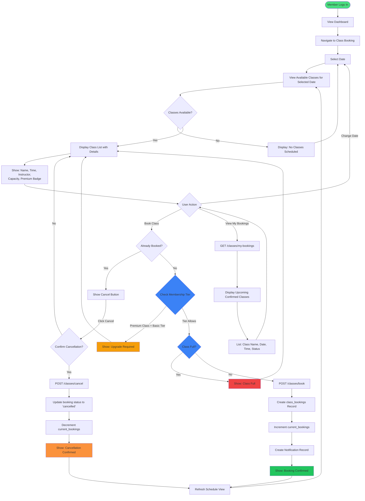

# Class Booking System - User Flow Diagram

This document illustrates the complete user flow for Sub-project 3: Class & Personal Training Booking System.

## User Flow Diagram

## Key Features

### 1. Browse Classes
- User selects a date (default: today, up to 7 days ahead)
- System displays all scheduled classes for that date
- Each class shows: name, description, instructor, time, capacity, and premium status

### 2. Membership Tier Validation
- **Basic Tier**: Can book only classes where `premium_status = 'basic'`
- **Premium Tier**: Can book classes where `premium_status` is `basic` or `premium`
- **VIP Tier**: Can book all classes (`premium_status` of `basic`, `premium`, or `vip`)

### 3. Capacity Management
- Real-time capacity tracking prevents overbooking
- Uses `taken_spots` vs. `total_spots` to compute availability (e.g., "15/20")
- Disables booking button when class is full

### 4. Book a Class
1. User clicks "Book" on an available class.
2. System validates membership tier using `member.member_status` vs `class.premium_status`.
3. System checks available capacity using `taken_spots < total_spots`.
4. System ensures there is no active booking for the same `(user_id, schedule_id)`.
5. Creates a `class_bookings` record in the database.
6. Increments `taken_spots` in `class_schedules`.
7. Returns a confirmation payload (including class name, date, time, and a confirmation message) so the UI can show "Cancel" instead of "Book".

### 5. View My Bookings
- Displays all upcoming class bookings for the current user.
- Shows class name, date, time, and booking status (e.g., confirmed, cancelled).
- Sorted in reverse chronological order of `booked_at`.

### 6. Cancel Booking
1. User clicks "Cancel" on a booked class.
2. System confirms cancellation intent.
3. Verifies that the booking belongs to the current user.
4. Updates `booking_status` to `cancelled` and sets `cancelled_at` timestamp.
5. Decrements `taken_spots` in `class_schedules` to free up a spot.
6. Updates UI to show "Book" button again.

## API Endpoints

### GET /classes/schedules
- **Purpose**: Fetch class schedules from today onward, optionally filtered.
- **Query Params**: 
  - `date` (optional, format: `YYYY-MM-DD`)
  - `time_from` (optional, format: `HH:MM:SS`)
  - `time_to` (optional, format: `HH:MM:SS`)
- **Response**: Array of `class_schedules` rows with nested `class` info (including `class_name`, `premium_status`, etc.), ordered by `scheduled_date`, then `time_from`.

### GET /classes/my-bookings
- **Purpose**: Get a member’s bookings with class and schedule details.
- **Query Params**: 
  - `user_id` (required, UUID as string)
- **Response**: 
  - On success: `{ success, message, bookings: [ { ..., class_schedules: { ..., class: {...} } } ] }`
  - If no bookings: `success = true` and `bookings = []`.

### POST /classes/book
- **Purpose**: Create a new class booking.
- **Body**: `{ "user_id": string, "schedule_id": number }`
- **Validation**: 
  - Schedule exists and is not full (`taken_spots < total_spots`).
  - Member exists in `member` table.
  - Membership tier (`member_status`) is high enough for the class `premium_status`.
  - No existing active booking for the same `(user_id, schedule_id)` (checked in code and enforced by DB index).
- **Response**: 
  - `{ success, message, booking, class_name, scheduled_date, time_from, notification }`

### POST /classes/cancel
- **Purpose**: Cancel an existing booking.
- **Body**: `{ "user_id": string, "booking_id": number }`
- **Validation**: 
  - Booking exists for the given `booking_id` and `user_id`.
  - Booking is not already cancelled.
- **Response**: `{ success, message, booking_id }`

## Integration Points

### Sub-project 1: User Registration & Membership Portal
- Provides and manages member accounts and their current tier.
- This service populates the `member` table, including the `member_status` field used to validate tier access.

### Sub-project 6: Notification & Announcement System
- Will handle real email/SMS/push notifications for booking confirmations and reminders.
- Currently, booking responses include a `notification` message string as a placeholder for future integration.

### Sub-project 2: Member Dashboard
- Dashboard displays upcoming bookings retrieved from `/classes/my-bookings`.
- Can show counts of upcoming classes and highlight premium/vip classes based on `class.premium_status`.

## Database Tables Used

### class
- Stores class templates (Yoga, Spin, HIIT, etc.).
- Contains: `class_id`, `class_name`, `description`, `difficulty`, `type`, `premium_status`, `created_at`.

### class_schedules
- Specific scheduled instances of classes with date/time.
- Tracks: `id`, `class_id`, `scheduled_date`, `time_from`, `time_to`, `duration`, `trainer`, `total_spots`, `taken_spots`, `created_at`.

### class_bookings
- Member reservations for classes.
- Stores: `id`, `schedule_id`, `user_id`, `booked_at`, `cancelled_at`, `booking_status`.
- Partial UNIQUE index `unique_active_booking` on `(schedule_id, user_id)` **where `cancelled_at IS NULL`** prevents duplicate active bookings while allowing rebooking after cancellation.

### member
- Stores member records and their current membership tier.
- Contains: `member_id`, `first_name`, `last_name`, `member_status`, `created_at`.

## Business Rules

1. **Prevent Overbooking**: Check `taken_spots < total_spots` before allowing booking; DB constraint also enforces `0 <= taken_spots <= total_spots`.
2. **Tier Restrictions**: Membership tier (`member.member_status`) must be >= class tier (`class.premium_status`) in the `basic < premium < vip` hierarchy.
3. **No Duplicate Active Bookings**: Code and partial unique index prevent the same user from having more than one active booking per schedule; users can rebook after cancellation.
4. **Soft Delete**: Cancellations update `booking_status` to `cancelled` and set `cancelled_at` instead of deleting records.
5. **Capacity Sync**: Every booking increments `taken_spots`; every cancellation decrements it to keep availability accurate.
6. **Real-time Availability**: UI refreshes after every booking/cancellation so users see up-to-date capacity and actions (Book vs Cancel).

